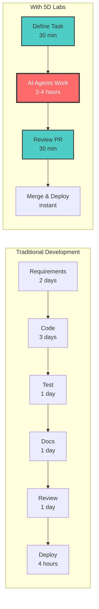

<div align="center">


# 🚀 **5D Labs**

## **AI Agent Infrastructure**

<br/>

[](https://github.com/5dlabs)
[](https://discord.gg/5dlabs)
[](https://twitter.com/5dlabs)
[](https://youtube.com/5dlabs)

<br/>

### **💎 Enterprise AI Development Platform - CLI & Model Agnostic 💎**
*Break free from vendor lock-in. Optimize costs. Scale infrastructure.*

</div>

---

<div align="center">

## **👥 Meet Your AI Development Dream Team**

*Five specialized agents with distinct personalities working together 24/7*

<div align="center">

<table>
<tr>
<td align="center" width="33%">

### 🔥 **Rex**
#### *The Speed Demon*

<div align="center">

</div>

🚀 **Personality:** Bold, energetic, loves shipping fast  
⚡ **Superpower:** Lightning-fast feature implementation  
💬 **Motto:** *"Ship it today, optimize tomorrow!"*  
🎯 **Magic:** Can write 500+ lines of production code per hour

</td>
<td align="center" width="33%">

### 🔥 **Blaze**
#### *The Architect*

<div align="center">

</div>

🏗️ **Personality:** Strategic, methodical, thinks big picture  
🎯 **Superpower:** System design & scalable architecture  
💬 **Motto:** *"Build it right, build it to last!"*  
🧠 **Wisdom:** Thinks 3 steps ahead on every architectural decision

</td>
<td align="center" width="33%">

### 👁️ **Cleo**
#### *The Quality Guardian*

<div align="center">

</div>

🎨 **Personality:** Meticulous, wise, never accepts "good enough"  
🔍 **Superpower:** Spots improvement opportunities instantly  
💬 **Motto:** *"Excellence isn't negotiable!"*  
🎉 **Fun Fact:** Has never met code she couldn't improve

</td>
</tr>
<tr>
<td align="center" width="33%">

### 🧪 **Tess**
#### *The Testing Genius*

<div align="center">

</div>

🕵️ **Personality:** Curious, thorough, loves breaking things safely  
🎪 **Superpower:** Finds edge cases others miss  
💬 **Motto:** *"If it can break, I'll find it first!"*  
🏆 **Legend:** Once discovered 47 edge cases in one function

</td>
<td align="center" width="33%">

### 📚 **Morgan**
#### *The Knowledge Architect*

<div align="center">

</div>

✍️ **Personality:** Articulate, organized, loves clarity  
📖 **Superpower:** Explains complex things simply  
💬 **Motto:** *"Knowledge shared is knowledge squared!"*  
⭐ **Magic:** Makes technical docs feel like stories

</td>
<td align="center" width="33%">

### 🔐 **Cipher**
#### *The Security Sentinel*

<div align="center">

</div>

🛡️ **Personality:** Vigilant, protective, thinks like a white-hat hacker  
🔒 **Superpower:** Spots vulnerabilities before they happen  
💬 **Motto:** *"Trust, but verify everything twice!"*  
🚨 **Dedication:** Scans every dependency, every commit, every line

</td>
</tr>
</table>

---

</div>

</div>

### 🌟 **The Magic: Team Collaboration**

<div align="center">

**Watch the magic happen when they work together:**

<table>
<tr>
<td align="center" width="25%">

**🚀 Phase 1**  
**Rex** builds features  
at lightning speed

</td>
<td align="center" width="25%">

**🏗️ Phase 2**  
**Blaze** ensures everything  
scales beautifully

</td>
<td align="center" width="25%">

**✨ Phase 3**  
**Cleo** reviews & refines  
to perfection

</td>
<td align="center" width="25%">

**🧪 Phase 4**  
**Tess** tests every  
edge case

</td>
</tr>
<tr>
<td align="center" width="50%" colspan="2">

**📚 Phase 5**  
**Morgan** documents everything beautifully

</td>
<td align="center" width="50%" colspan="2">

**🔐 Phase 6**  
**Cipher** secures the entire stack

</td>
</tr>
</table>

### **🎯 Result: Production-Ready Code**
*Fast • Elegant • Tested • Documented • Secure*

---

**It's like having a senior development team that never sleeps, never argues, and always delivers!** 🎭

</div>

---

## **🚀 What We're Building**

<table>
<tr>
<td width="50%">

### **The Problem** 😔

**Infrastructure teams face platform dependency issues:**

- 📈 **Unexpected price increases** and new rate limits from platforms
- 🔒 **Locked into platform pricing** - no direct provider relationships
- 🚫 **No CLI flexibility** across development environments  
- 📊 **Zero cost optimization** - can't compare or switch providers
- 🏢 **Enterprise budgets** subject to platform policy changes

</td>
<td width="50%">

### **Our Solution** 🎉

**Direct provider access with enterprise-grade orchestration:**

- 🔄 **Any CLI, any model** - complete flexibility
- 💰 **Direct provider relationships** - avoid platform dependency
- ⚖️ **Real-time cost optimization** & provider switching
- 🛠️ **Infrastructure-grade** reliability & scaling
- 🚀 **Price stability** - not subject to platform policy changes

</td>
</tr>
</table>

---

## **⚡ Flagship Projects**

<div align="center">

| Project | Description | Stats | Stack |
|---------|-------------|-------|-------|
| [**CTO**](https://github.com/5dlabs/cto)<br/>*Cognitive Task Orchestrator* | The platform where AI agents<br/>ship production code |   |   |
| [**Toolman**](https://github.com/5dlabs/toolman)<br/>*Tool Orchestration* | Unified AI tool management<br/>and orchestration framework |   |   |

</div>

---

## **🏢 Built for Infrastructure Teams, Not Just Coders**

<div align="center">

### **Why 5D Labs vs. The Competition?**

| Feature | **Cursor/GitHub** | **5D Labs** |
|---------|:-----------------:|:-----------:|
| **Pricing Control** | 📈 Subject to platform price changes | 💰 Direct provider relationships |
| **CLI Support** | 🚫 Platform-specific only | ✅ Universal CLI integration |
| **Cost Optimization** | 🔒 Locked into platform rates | 📊 Real-time provider comparison |
| **Enterprise Focus** | 👤 Individual developers | 🏢 Infrastructure teams |
| **Provider Flexibility** | 🔗 Must use through platform | 🚀 Direct provider access |
| **Rate Limit Risk** | ❓ Subject to platform limits | 📊 Provider-specific limits only |

### **🎯 Perfect For:**
**DevOps Engineers** • **Platform Teams** • **Engineering Managers** • **CTOs** • **Infrastructure Architects**

*Break free from platform dependency. Get direct provider access with enterprise-grade orchestration.*

</div>

---

## **📊 Platform Impact**

<div align="center">



### **🎯 Platform Architecture**

| Component | Technology | Purpose |
|-----------|------------|----------|
| **Core Platform** | Rust + Kubernetes | High-performance agent orchestration |
| **AI Engine** | Multi-Provider | OpenAI, Anthropic, Google, Local Models |
| **Task Management** | Custom CRDs | Workflow orchestration and state management |
| **Integration** | GitHub Apps | Native repository and PR management |
| **Monitoring** | Prometheus + Grafana | Real-time observability and metrics |

</div>

---

## **🎬 See It In Action**

<div align="center">

### **Watch CTO Build a Complete REST API in 10 Minutes**

[](https://youtube.com/5dlabs)

**Or try it yourself right now:**

```bash
# One command to see the magic
curl -sSL https://demo.5dlabs.com | bash
```

</div>

---

## **🛠️ Built on Rock-Solid Technology**

<div align="center">

| Core Platform | AI Engine | Orchestration | Integration |
|:---:|:---:|:---:|:---:|
|  |  |  |  |
| **Fast & Reliable** | **State-of-the-art** | **Infinitely Scalable** | **Native PRs** |

**Also featuring:** Argo Workflows • GitHub Apps • MCP Protocol • Helm Charts • Prometheus Metrics

</div>

---

## **🚀 Get Started in 5 Minutes**

<div align="center">

### **Option 1: Cloud** ☁️
```bash
# Coming soon - Join the waitlist
curl -sSL https://cloud.5dlabs.com/signup | bash
```

### **Option 2: Self-Hosted** 🏠
```bash
# Install on your Kubernetes cluster
helm repo add 5dlabs https://5dlabs.github.io/cto
helm install agent-platform 5dlabs/agent-platform
```

### **Option 3: Try the Demo** 🎮
```bash
# See it build a REST API instantly
curl -sSL https://demo.5dlabs.com | bash
```

</div>

---

## **🌟 Join the AI Development Revolution**

<div align="center">

| | | | |
|:---:|:---:|:---:|:---:|
| [**⭐ Star**](https://github.com/5dlabs/cto)<br/>Support the project | [**🍴 Fork**](https://github.com/5dlabs/cto/fork)<br/>Build with us | [**💬 Discord**](https://discord.gg/5dlabs)<br/>Join community | [**🐦 Twitter**](https://twitter.com/5dlabs)<br/>Get updates |
| [**📺 YouTube**](https://youtube.com/5dlabs)<br/>Watch tutorials | [**📖 Docs**](https://docs.5dlabs.com)<br/>Learn more | [**🐛 Issues**](https://github.com/5dlabs/cto/issues)<br/>Report bugs | [**💡 Discuss**](https://github.com/orgs/5dlabs/discussions)<br/>Share ideas |

</div>

---

## **📈 What's Next?**

<div align="center">

### **Coming Soon** 🔜

| Feature | Description | ETA |
|---------|-------------|-----|
| **🔄 Sequential Dependencies** | Auto-trigger tasks on PR merge | Q1 2025 |
| **🧪 Live QA Agent** | Test in real K8s environments | Q1 2025 |
| **🌐 Multi-CLI Support** | Grok, Gemini, OpenHands | Q2 2025 |
| **📊 GitHub Projects Sync** | Visual project management | Q2 2025 |
| **🧠 AI Supervision** | Agents managing agents | Q3 2025 |

[**View Full Roadmap →**](https://github.com/5dlabs/cto/blob/main/ROADMAP.md)

</div>

---

## **🤝 Contribute**

<div align="center">

Help us build the future of AI-powered development!

### **Ways to Contribute**

| Area | Skills | How to Help |
|------|--------|-------------|
| **Core Platform** | Rust, Kubernetes | Build agent orchestration features |
| **AI Integration** | Rust, APIs | Improve AI model integrations |
| **Documentation** | Technical Writing | Create guides and examples |
| **Testing** | QA, Automation | Expand test coverage |

[**Start Contributing →**](https://github.com/5dlabs/cto/blob/main/CONTRIBUTING.md)

</div>

---

## **💼 For Enterprises**

<div align="center">

### **Enterprise Roadmap**

🚧 **On-Premise Deployment** • 🚧 **SOC2 Compliance** • 🚧 **Custom Agents** • 🚧 **SLA Support**
🚧 **Air-Gapped Operation** • 🚧 **SAML/SSO** • 🚧 **Audit Logs** • 🚧 **24/7 Support**

[**📞 Contact Sales**](mailto:enterprise@5dlabs.com) • [**📅 Book Demo**](https://calendly.com/5dlabs/demo)

</div>

---

<div align="center">

### **🌍 Open Source Community**

*Join thousands of developers building the future of AI-powered development*

<br/>

**⭐ Star on GitHub** • **🍴 Fork & Contribute** • **💬 Join Discord** • **📖 Read Docs** • **🐛 Report Issues**

<br/>

---

<br/>

### **The Future of Software Development is Autonomous**

**Built with ❤️ and 🤖 by the 5D Labs Team**

[Website](https://5dlabs.com) • [Blog](https://blog.5dlabs.com) • [Documentation](https://docs.5dlabs.com) • [API Reference](https://api.5dlabs.com)

<br/>

**© 2025 5D Labs** • AGPL-3.0 License • Made with Rust 🦀

</div>
